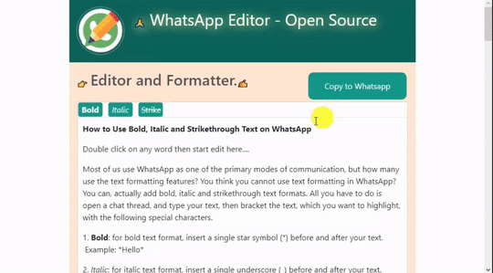

#   whatsapp-editor
WhatsApp text chat editor with formatter, it's generally used for bold, italic and strike-through  format to word or line to basic WhatsApp text chat formatter.

<h3>👀 How it work? Demo</h3>
🔗  Live Demo: <a href='http://ekalai.org/whatsapp-editor/'> http://ekalai.org/whatsapp-editor </a>

	

	
	

<h3>🚀 How to run this source code?</h3>

	Download the code, after downloaded zip file, extract it, if extracted then open the folder, open it editor.html file.

<h3>🔗 Reference</h3>

	<a href='https://github.com/jaredreich/pell'> pell is the simplest and smallest WYSIWYG text editor for web, with no dependencies</a>					

		

<h3>🍵 Support</h3>

	<a href='http://ekalai.org/donate'>🧑‍🤝‍🧑 Donate</a>					

